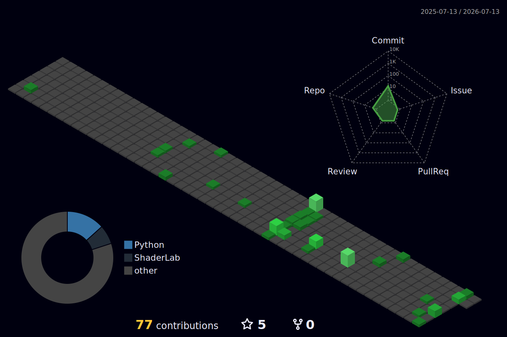

<div align="center">


</div>


## sysinfo

<div align="center">


</div>


## whoami

```cpp
class MontgomeryBrown {

public:

    const string university = "Virginia Tech";
    const string degrees     = "Computer Engineering + Computer Science";
    const string concentration = "Chip-Scale Integration";

    vector<string> interests = {
        "computer architecture",
        "embedded systems",
        "systems programming",
        "hardware/software co-design",
        "microprocessor research",
        "operating systems",
        "compilers",
        "software engineering"
    };

};
```


## log

```
$ ./build.sh montgomery_brown

[1/4] installing unity-gamedev.......... done (2022–2025)
      → 4 games shipped, 1 VR project
[2/4] installing arduino-embedded....... done (2022–present)
      → hardware/software co-design
[3/4] installing dual-degree............ in progress (2025–)
      → CompE + CS, Virginia Tech
[4/4] target: microprocessor research... queued
```


## stack

<div align="center">


</div>


## compiled

<table width="100%">
<tr>
<td width="50%" valign="top">

**🔒 Arduino Security**

Embedded classroom security system built on an Arduino microcontroller.


<a href="https://github.com/MintyTheCoder/Arduino-Security"></a>

</td>
<td width="50%" valign="top">

**🎮 RoadBattlers**

Programming-focused Unity game developed during high school.


<a href="https://github.com/MintyTheCoder/RoadBattlers"></a>

</td>
</tr>
<tr>
<td width="50%" valign="top">

**☕ Java Calculators**

Terminal and Swing calculator implementations.


<a href="https://github.com/MintyTheCoder/JavaCalculators"></a>

</td>
<td width="50%" valign="top">

**⏱️ PyTimerStopwatch**

CLI and GUI stopwatch/timer application.


<a href="https://github.com/MintyTheCoder/PyTimerStopwatch"></a>

</td>
</tr>
</table>


## contribution grid

<div align="center">



</div>

<div align="center">


</div>
